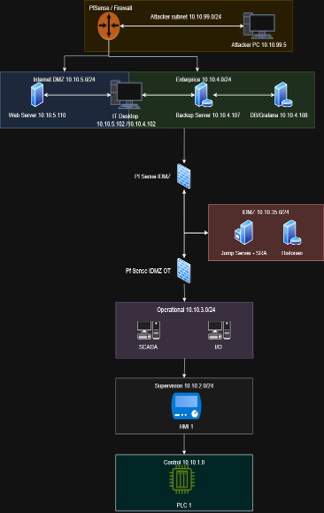

# Network Diagram

The following diagram presents the complete architecture of the OT/ICS Red Team training laboratory.

The environment is segmented according to a Purdue-inspired architecture and includes the external attacker network, the Internet-facing DMZ, the Enterprise network, the Industrial DMZ, the Operations network, the Supervision network, and the Controller network.

## Architecture

## Network Flow

The intended progression through the environment is:

`Attacker → Internet-facing DMZ → Enterprise → Industrial DMZ → Operations → Supervision / Controller Network`

Direct communication between non-adjacent network levels is restricted by the firewall architecture.

Three pfSense firewalls are used to enforce segmentation between the different network zones.
